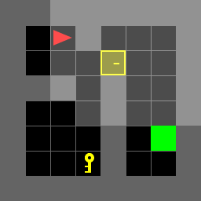

# Shortest optimal path using Dynamic Programming

## Objective
To implement dynammic programming for the Door-Key problems.
<p align="center">
</br>
</p>

There are 7 test scenes you have to test and include in the report.

|           doorkey-5x5-normal            |
| :-------------------------------------: |
|  |

|           doorkey-6x6-normal            |            doorkey-6x6-direct            |            doorkey-6x6-shortcut            |
| :-------------------------------------: | :--------------------------------------: | :----------------------------------------: |
|  |  |  |

|           doorkey-8x8-normal            |            doorkey-8x8-direct            |            doorkey-8x8-shortcut            |
| :-------------------------------------: | :--------------------------------------: | :----------------------------------------: |
|  |  |  |

## Installation

- Install Python version `3.7 ~ 3.10`
- Install dependencies
```bash
conda create -n env_shortestPath python=3.10
conda activate env_shortestPath
git clone  https://github.com/suryapilla/Autonomous-Navigation.git
cd Autonomous-Navigation
pip install -r requirements.txt
```

## Code
### 1. The below command is for known environments
```
python main.py
```
<p align="center">
</br>
</p>

### 2. The below command is for the shortest path in unkown environmnet

```
python main2.py
```
<p align="center">
</br>
</p>


